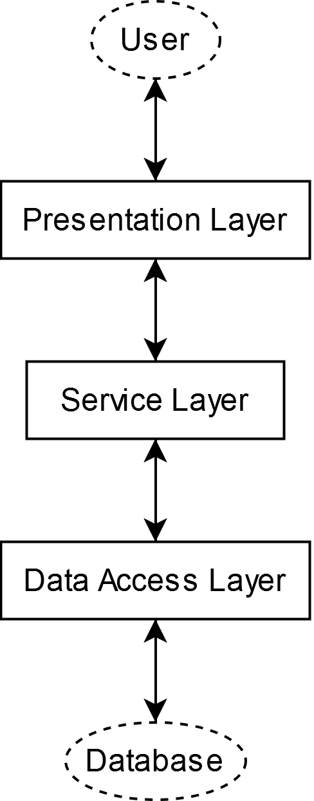
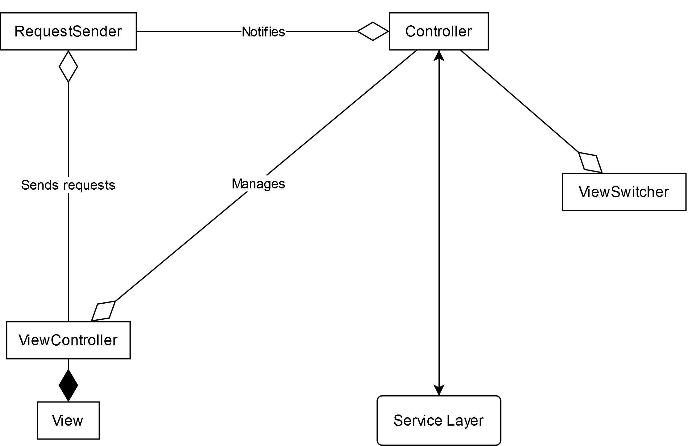

This page contains the documentation about this project's source code, API, principles and architecture

# Table of Contents

1. [Tech stack](#tech-stack)
2. [Architecture](#Architecture)
	1. [High level architecture](#high-level-architecture)
		1. [Data Access Layer](#data-access-layer)
		2. [Service Layer](#service-layer)
		3. [Presentation Layer](#presentation-layer)
	2. [Presentation Layer in details](#presentation-layer-in-details)
		1. [ViewController](#ViewController)
		2. [RequestSender](#RequestSender)
		3. [Controller](#Controller)

# Tech stack

This project makes use of the following dependencies as its main tech stack:

- Spring Core, for IoC, Aspects and DI capabilities
- Spring Boot for easy auto-configuration
- Spring Data JPA/Hibernate as its ORM persistence framework
- Spring Boot Validation/Hibernate Validator as the standardized validation framework
- JavaFx as the GUI framework
- FxWeaver for Spring/JavaFx integration
- Lombok to reduce boilerplate codes

# Architecture

This project's architecture closely resembles the Three Layers Architecture and the MVC/Front Controller Pattern

## High level architecture

On the highest level, this project follows the Three Layers Architecture, where the entire project is divided into 3 layers, each with its own separate responsibilities

### Data Access Layer

The Data Access Layer is responsible for managing the application's interaction with the database or other data sources. It abstracts and encapsulates all data-related operations, ensuring that the application logic does not need to interact directly with raw data sources.

### Service Layer

The Service Layer serves as the intermediary between the Presentation Layer and the Data Access Layer. It is responsible for implementing the application's core business logic, which includes orchestrating operations, and ensuring data integrity, providing clean, reusable APIs for the application and ensuring a separation of concerns by keeping the user interface and data access code independent of the business logic.

### Presentation Layer

The Presentation Layer is the topmost layer, responsible for interacting with the user. It focuses on presenting data to the user, handling user inputs, and delegates to the Service Layer to perform the necessary operations. This layer ensures that the application's business logic and data handling are abstracted from the user interface.

## Presentation Layer in details

The presentation layer is modeled after the Front Controller and MVC pattern. Specifically, the layer is sub-divided into the following components:

### ViewController

Each `ViewController` and its associated `fxml` file, makes up a page of the application, in which the `ViewController` is responsible for handling the internal logic of the page. The `ViewController` displays data provided by other components, and communicates with other components in a form of "requests".

### RequestSender 

The component that encapsulates the layer's "requests". Each `RequestSender` denotes a single type of request, with a specific set of arguments. A `RequestSender` is responsible for forwarding any request it received to the receiving components.

### Controller

Acts as the intermediary between other components. Each `Controller` is responsible for receiving and handling requests, retrieving from and delegating to Services, and managing `ViewController`.
