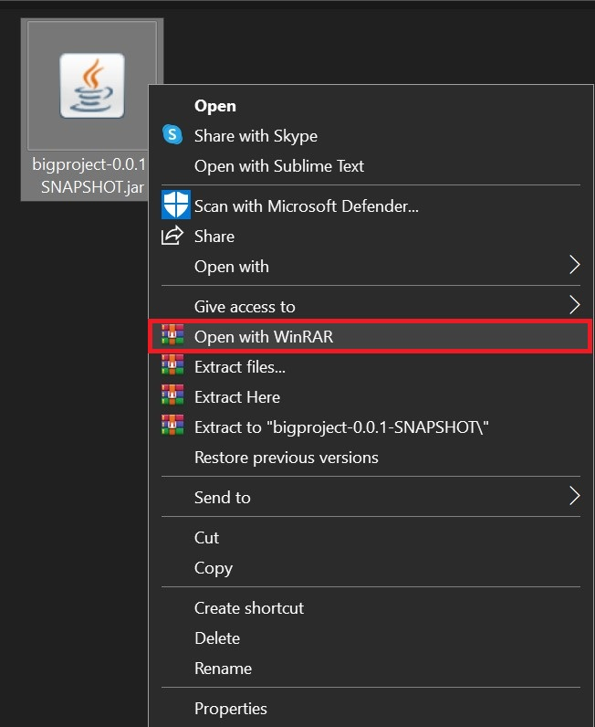
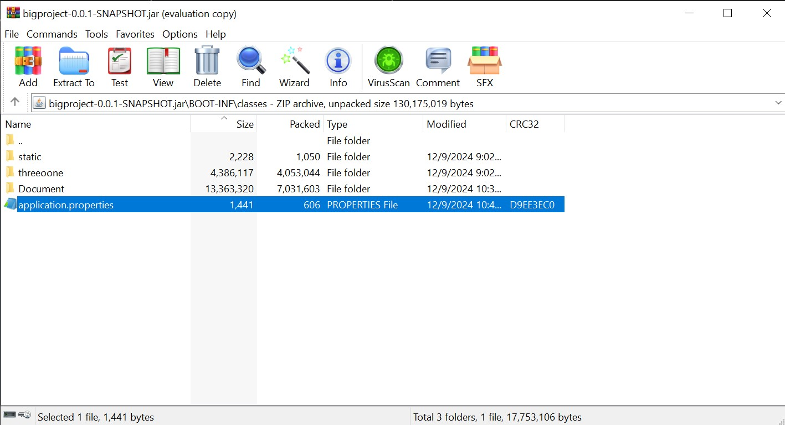
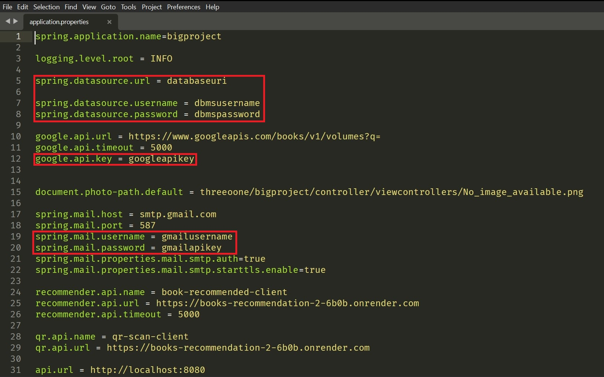

# Library Management System

Group project for Object-Oriented Programing class - INT2204 7

Contributors:
- Hoàng Hữu Đức - 23020046 - [ducbrick](https://github.com/ducbrick)
- Nguyễn Quốc Huy - 23020046 - [Huy1902](https://github.com/Huy1902)
- Bùi An Huy - 23020079 - [purupurupkl](https://github.com/purupurupkl)

Instructors:
- TS. Võ Đình Hiếu
- CN. Vũ Trọng Thanh

# Table of Contents
1. [Overview](#Overview)
2. [Prerequisite](#Prerequisite)
3. [Installing](#Installing)
4. [Configuring](#Configuring)
	1. [Accessing application configuration file](#accessing-application-configuration-file)
	2. [Configure your database](#configure-your-database)
	3. [Configure Google API key](#configure-google-api-key)
	4. [Configure email API](#configure-email-api)
	5. [Install JDK 21](#install-jdk-21)
5. [Run the application](#run-the-application)

# Overview

This repository contains the source code and necessary resources/instructions to build, run and use a library management application.

The application is intended to be a simple and efficient application to aid librarians in managing books, members, and library transactions. It streamlines tasks like tracking inventory, handling checkouts and returns, and maintaining members records. 

The rest of this page will guide you through the process of installing and configuring the application. For this project documentation, refer to [this page](README-documentation.md)

# Prerequisite

The application has a few requirements that should be fulfill in order to be configured and run:
- [JDK](https://www.oracle.com/java/) version `21.0.4 2024-07-16 LTS`
- [PostgreSQL](https://www.postgresql.org/) version `17.0`
- A file archiver, such as 7-zip, WinRAR, etc.
- Basic understanding of Java and DBMS

# Installing

You can download the packaged [compressed archive folder](https://github.com/ducbrick/bigproject/releases/download/beta/bigproject-0.0.1-SNAPSHOT.zip) directly from [this Github repository](https://github.com/ducbrick/bigproject)

After you've downloaded the `.zip` file, extract it using your preferred archiving tool. Once you're done, you should see 2 files: `bigproject-0.0.1-SNAPSHOT.jar` and `schema.sql`

# Configuring

## Accessing application configuration file

Open `bigproject-0.0.1-SNAPSHOT.jar` with your preferred archiving tool (for example, WinRAR)



Navigate to `BOOT-INF/classes` to access `application.properties`



Open `application.properties`. There, there are some values that you need to provide before running your application, as denoted in the following image.



## Configure your database

This application uses [PostgreSQL](https://www.postgresql.org) as its preferred DBMS.

You can build Postgres directly from its source code. Or alternatively, you can use the packaged installers and follow the instructions provided.

After you've installed Postgres, you need to create a new database and an account with necessary authorities.

In your new database, execute the content in the file `schema.sql`

Finally, you need to provide your database url, username and password to the configuration, for example:

```
spring.datasource.url = jdbc:postgresql://localhost:5432/postgres
spring.datasource.username = postgres
spring.datasource.password = 123456
```

## Configure Google API key

To create your application's API key:

1. Go to the [API Console](https://console.developers.google.com/).
2. From the project list, select a project or create a new one (if you haven't had one yet)
3. If the API & service page isn't already open, open the left side menu and select **APIs & services**.
4. On the left, choose **Credentials**.
5. Click **Create credentials** and then select **API key**.

*Note after creating API key*: 
You should make your API key restrict by following this step:

1. Go to the [API Console](https://console.developers.google.com/).
2. On the left, choose **Credentials**.
3. In **API Keys** list, choose ellipsis icon to show context menu.
4. In context menu pop-up,  choose **Edit API key**.
5. Now you can set set an **application restriction** and **API restrictions**

After you've obtained your API key, configure the property file accordingly, for example:

```
google.api.key = abcxyz
```

## Configure email API

Follow the following instructions to set up your gmail API account:

1. Access this [link](https://myaccount.google.com/signinoptions/twosv) and turn on 2-step verification if you haven't had one yet.
2. In this page, scroll down then choose **App passwords** 
3. Set **App name** then press **Create**
4. A pop-up screen will appear with your app password

Once you're done, edit the property file to use your gmail account and password, for example:

```
spring.mail.username = skibidi@gmail.com
spring.mail.password = abcxyz
```

## Install JDK 21

Follow the instructions at [this link](https://www.oracle.com/java/technologies/downloads/#java21) to install `JDK 21`

# Run the application

After you've configured the application, you can run it with the command `java -jar bigproject-0.0.1-SNAPSHOT.jar` in Powershell, or by double-clicking the `jar` file.
